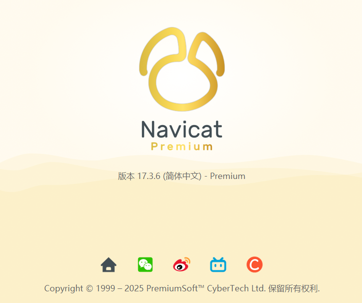

# 🗂️ Navicat_Keygen_Patch / Navicat学习资源合集

> ⚠️ **Important Notice / 重要声明**
> - **English**: This repository is for learning and research purposes only. Please delete within 24 hours.
> - **中文**: 本仓库仅供学习和研究使用，请于24小时内删除。
> 
> 🛒 **Purchase Official Version / 购买正版**
> - **English**: Buy from official store if needed: [Navicat Official Store](https://www.navicat.com.cn/store/navicat-premium-plan)
> - **中文**: 如需商业用途，请购买正版：[Navicat官方商店](https://www.navicat.com.cn/store/navicat-premium-plan)

**✅ Latest Verified Version / 最新验证可用版本 : `V17.3.6` on `2025-11-30`**

with️ Navicat Wimmm DDL Patch

## 📋 Repository Overview / 仓库内容概览

| Tool Name / 工具名称 | Supported Versions / 支持版本 | Type / 类型 | Status / 状态 |
|-------------------|---------------------------|-------------|---------------|
| 🔧 Navicat Keygen Patch | 15/16/17 | Activation Tool / 激活工具 | Available / 可用 |
| 🔄 Navicat Trial Reset | 15/16/17 | Trial Reset / 试用重置 | Available / 可用 |
| 🚀 NavicatCracker | 16.X | Crack Tool / 破解工具 | Available / 可用 |
| 🛠️ Navicat Wimmm Cracker | 16/17 | DLL Patch / DLL补丁 | ✅ Recommended / 最新推荐 |

## 🎯 Usage Guide / 使用指南

### 📥 Step 1: Download Resources / 第一步：下载资源
- **English**: Download study resource package [Navicat_Wimmm_Cracker_16_17.x.zip](https://github.com/moshowgame/Navicat_Keygen_Patch/blob/main/Navicat_Wimmm_Cracker_16_17.x.zip)
- **中文**: 下载学习资源包

### 💻 Step 2: Install Navicat / 第二步：安装Navicat
- **English**: Download and install `navicat17_premium_cs_x64.exe`
- **中文**: 下载并安装 Navicat Premium

### 🔒 Step 3: Close Program / 第三步：关闭程序
- **English**: Close Navicat completely before proceeding
- **中文**: 安装完成后请勿打开Navicat，如已打开请先退出

### 🔧 Step 4: Apply Patch / 第四步：应用补丁
- **English**: Unzip and place the correct `winmm.dll` into Navicat installation folder
- **中文**: 解压并将对应系统版本的 `winmm.dll` 放置到Navicat安装目录

### ✅ Step 5: Complete / 第五步：完成
- **English**: Finish! Ready to use 🎉
- **中文**: 完成！可以开始使用了 🎉

## 🔬 Latest Verification Information / 最新验证信息

## 👨‍💻 Project Contributors / 项目贡献者

| Tool Name / 工具名称 | Original Author / 原作者 | Collector / 收集者 |
|-------------------|------------------------|-------------------|
| 🔧 Navicat Keygen Patch | DFox | zhengkai.blog.csdn.net |
| 🔄 Navicat Reset Patch | Anonymous Developer / 匿名开发者 | zhengkai.blog.csdn.net |
| 🚀 NavicatCracker | tgMrz@DoubleSine | zhengkai.blog.csdn.net |
| 🛠️ Navicat Wimmm Cracker | ajiajishu | zhengkai.blog.csdn.net |

## 📝 Important Notes / 注意事项

### ⚠️ Usage Guidelines / 使用规范
- **English**: Execute trial reset patch every half month
- **中文**: 每半个月需执行一次试用重置补丁

### 🔒 Legal Compliance / 法律合规
- **English**: For learning and research only, not for commercial use
- **中文**: 仅供学习研究，请勿用于商业用途

### 📚 Security Recommendations / 安全建议
- **English**: Recommended to test in virtual machine environment
- **中文**: 建议在虚拟机环境中测试使用

### 🚫 Disclaimer / 免责声明
- **English**: Use at your own risk, authors assume no responsibility
- **中文**: 使用风险自负，作者不承担任何责任

---

**💡 Friendly Reminder / 温馨提示**
- **English**: Support official software for better technical support and updates!
- **中文**: 支持正版软件，享受更好的技术支持和更新服务！